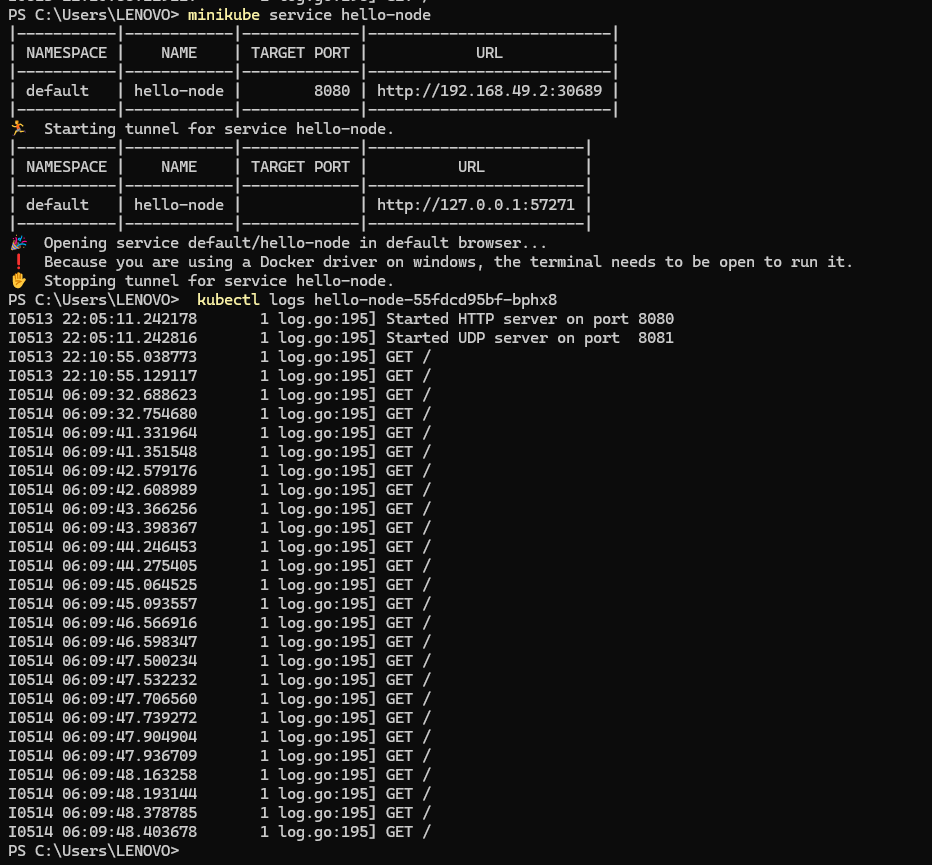

1. Compare the application logs before and after you exposed it as a Service.
    Yes, there is a difference because once the service is exposed, it can receive and log incoming requests. For example, if the hello-node service is repeatedly refreshed, the log will record each of these requests.
    
2. Notice that there are two versions of `kubectl get` invocation during this tutorial section.
The first does not have any option, while the latter has `-n` option with value set to
`kube-system`.
What is the purpose of the `-n` option and why did the output not list the pods/services that you
explicitly created?
> Hint: Do some reading about [Namespace in Kubernetes
documentation](https://kubernetes.io/docs/concepts/overview/working-with-objects/namespaces
/).
To make notes of your experience and reflection, please do the following:

In Kubernetes, the -n or --namespace option in kubectl commands specifies the namespace to target, isolating resources within the cluster. If we run kubectl get without specifying a namespace, it defaults to the default namespace and lists resources like pods or services created there. When the -n kube-system option is used, kubectl targets the kube-system namespace, which contains system-level resources critical for Kubernetes itself to operate, hence not showing the user-created services or pods unless they were specifically deployed in this namespace.